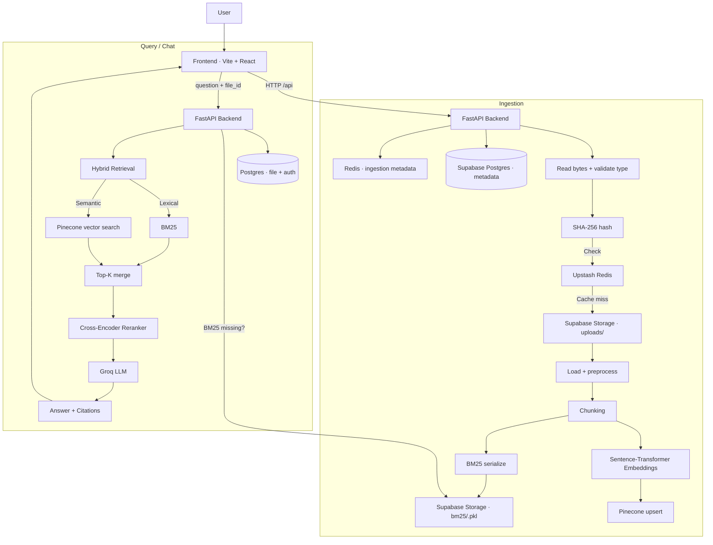

# AdvanceRAG — Production-Ready Document Intelligence Platform

> **Upload documents. Ask questions. Get grounded answers with citations.**
> A full-stack RAG system built for real-world deployment challenges — not just a tutorial.

[](https://fastapi.tiangolo.com/)
[](https://react.dev/)
[](https://www.pinecone.io/)
[](https://supabase.com/)
[](LICENSE)

---

## What Makes This Different

Most RAG demos skip the hard parts. This project tackles them head-on:

- **Hybrid retrieval** (BM25 + vector embeddings) — not just cosine similarity
- **Cross-encoder reranking** — precision on top of recall
- **Ephemeral storage survival** — BM25 artifacts persisted to Supabase, rehydrated on cold start
- **Cross-domain auth** — session cookies with `SameSite=None; Secure` across Vercel ↔ Render
- **Duplicate-aware ingestion** — SHA-256 file hashing prevents redundant embedding work
- **Two-layer caching** — Redis for both document embeddings (30-day TTL) and query results (1-hour TTL)

---

## Architecture

```
┌────────────────────────────────────────────────────────────────────┐
│                         INGESTION PIPELINE                         │
│                                                                    │
│  Upload → SHA-256 Hash → Redis Cache Check                         │
│                ↓ (cache miss)                                      │
│  Supabase Storage (raw file) → Chunk → Embed → Pinecone (vectors) │
│                                       ↓                           │
│                              BM25 Index → Supabase Storage (pkl)   │
└────────────────────────────────────────────────────────────────────┘

┌────────────────────────────────────────────────────────────────────┐
│                           QUERY PIPELINE                           │
│                                                                    │
│  Question → Redis Cache Check                                      │
│                ↓ (cache miss)                                      │
│  Parallel: [BM25 Retrieval] + [Pinecone Vector Search]             │
│                ↓                                                   │
│  Top-K Merge → Cross-Encoder Reranking → Groq LLM                 │
│                ↓                                                   │
│  Answer + Cited Chunks → Frontend                                  │
└────────────────────────────────────────────────────────────────────┘
```

**Full system flow (Mermaid):**



---

## Tech Stack

| Layer | Technology | Why |
|---|---|---|
| **Frontend** | React 18, TypeScript, Vite | Fast DX, type-safe |
| **Backend** | FastAPI (async) | Non-blocking I/O, auto docs |
| **Database** | Supabase Postgres (asyncpg) | Managed, scalable |
| **Storage** | Supabase Storage | Survives Render restarts |
| **Vector DB** | Pinecone | Managed ANN at scale |
| **Cache** | Upstash Redis | Serverless Redis, TTL support |
| **LLM** | Groq (llama-3) | Fastest inference available |
| **Embeddings** | Sentence Transformers | Local, no API cost |
| **Reranker** | Cross-Encoder | Precision layer on top of recall |
| **Auth** | Session cookies (bcrypt + HTTP-only) | Secure, stateful |

---

## Key Engineering Decisions

### Why Hybrid Retrieval?

Vector search excels at semantic similarity but fails on exact keyword matches — product IDs, names, rare tokens. BM25 catches what embeddings miss. Running both in parallel and merging top-K results consistently outperforms either approach alone.

### Why Store BM25 as a Pickle in Supabase?

Render's free tier uses ephemeral disks — a restart wipes local files. Serializing the BM25 index and uploading it to Supabase Storage means the backend can re-download it on cold start without re-indexing the entire document. This keeps ingestion a one-time cost.

### Why SHA-256 Hash Before Embedding?

Computing embeddings for a 200-page PDF costs real time and money. Hashing the raw bytes before touching the embedding model means identical uploads return instantly from Redis — zero redundant work.

### Why Session Cookies Instead of JWTs?

JWTs are stateless and can't be revoked without extra infrastructure. For this app, session-based auth with HTTP-only cookies gives server-side revocation, protects against XSS token theft, and is straightforward to implement securely.

---

## Real Deployment Challenges Solved

**1. GitHub Push Protection blocked the first deploy**
A Groq API key leaked into a Jupyter notebook cell output and was caught by GitHub's secret scanner. Fix: stripped the file from git history with `git filter-branch`, rotated the key, and added `*.ipynb` to `.gitignore`.

**2. Cross-domain cookies in production**
Vercel (frontend) and Render (backend) are different origins. Solved with `SameSite=None; Secure=True` on session cookies and explicit CORS origin allowlisting on the backend. Cookies also needed `httponly=True` to prevent JavaScript access.

**3. Cold start memory on Render**
Sentence Transformer models are large. Loading them on every request was too slow. Fixed by loading the embedding model and cross-encoder once at startup and reusing them across requests via module-level singletons.

---

## Getting Started

### Prerequisites

- Python 3.9+, Node.js 18+, Docker
- Accounts: [Groq](https://console.groq.com), [Pinecone](https://app.pinecone.io), [Supabase](https://supabase.com), [Upstash](https://upstash.com)

### 1. Clone and configure

```bash
git clone https://github.com/hetbabariya/AdvanceRAG
cd AdvanceRAG
cp .env.example .env
```

Fill in `.env`:

```env
GROQ_API_KEY=your_groq_key
PINECONE_API_KEY=your_pinecone_key
SECRET_KEY=your_secret_key   # python -c "import secrets; print(secrets.token_urlsafe(32))"

SUPABASE_URL=https://<project>.supabase.co
SUPABASE_SERVICE_ROLE_KEY=your_supabase_service_role_key
SUPABASE_BUCKET=AllInOneRag
SUPABASE_STORAGE_ENABLED=1

REDIS_URL=rediss://default:<password>@<host>:<port>
```

### 2. Start local services

```bash
docker-compose up -d
docker-compose ps   # verify postgres + redis are running
```

### 3. Backend setup

```bash
pip install -r backend/requirements.txt
python -m backend.api.database   # creates tables
uvicorn backend.api.main:app --reload --host 0.0.0.0 --port 8000
```

### 4. Frontend setup

```bash
cd frontend
npm install
npm run dev
```

App is at `http://localhost:5173`, API docs at `http://localhost:8000/docs`.

---

## API Reference

### Auth
| Method | Endpoint | Description |
|---|---|---|
| `POST` | `/register` | Create account |
| `POST` | `/login` | Login, set session cookie |
| `POST` | `/logout` | Destroy session |
| `GET` | `/me` | Current user info |

### Files
| Method | Endpoint | Description |
|---|---|---|
| `GET` | `/files` | List user's files |
| `POST` | `/ingest` | Upload + process document |
| `DELETE` | `/files/{filename}` | Delete file |

### Chat
| Method | Endpoint | Description |
|---|---|---|
| `POST` | `/chat` | Ask a question, get grounded answer |
| `GET` | `/chat/history` | Retrieve conversation history |

### System
| Method | Endpoint | Description |
|---|---|---|
| `GET` | `/health` | Health check |
| `GET` | `/cache/stats` | Redis hit rate + key count |

```bash
# Example cache stats response
curl http://localhost:8000/cache/stats
# → {"keyspace_hits": 150, "keyspace_misses": 50, "total_keys": 25, "hit_rate": 0.75}
```

---

## Caching Strategy

```
File Upload
───────────
1. Compute SHA-256 of raw bytes
2. Check Redis → hit? return instantly (30-day TTL)
3. Miss → embed, upsert Pinecone, cache metadata

Query
─────
1. Hash(question + file_id) as cache key
2. Check Redis → hit? return with ⚡ Cached badge (1-hour TTL)
3. Miss → full RAG pipeline → cache result
```

---

## Security

- Passwords hashed with **bcrypt** (cost factor 12)
- Session tokens in **HTTP-only cookies** (not accessible via JS)
- **CORS** restricted to specific origins
- All DB queries use **parameterized statements** (no SQL injection surface)
- Input validated with **Pydantic schemas**

---

## Performance

- **Async/await** throughout — no blocking I/O
- **Connection pooling**: 20 Postgres connections + 10 overflow
- **Parallel retrieval**: BM25 and vector search run concurrently with `asyncio.gather`
- **Model singletons**: Sentence Transformer and cross-encoder loaded once at startup
- **Two-layer caching**: eliminates redundant embedding + LLM calls

---

## Monitoring

```bash
# Cache performance
curl http://localhost:8000/cache/stats

# Service health
curl http://localhost:8000/health

# Logs
docker-compose logs -f
```

---

## Troubleshooting

**Database won't connect**
```bash
docker-compose ps        # is postgres running?
docker-compose logs postgres
docker-compose restart postgres
```

**Redis errors**
```bash
docker-compose exec redis redis-cli ping   # should return PONG
```

**Frontend build fails**
```bash
cd frontend && rm -rf node_modules package-lock.json && npm install
```

**BM25 artifact missing on query**
The backend auto-downloads from Supabase Storage on first query after restart. Check `SUPABASE_STORAGE_ENABLED=1` is set and the bucket exists.

---

## Project Structure

```
AdvanceRAG/
├── backend/
│   └── api/
│       ├── main.py          # FastAPI app + routes
│       ├── database.py      # Postgres schema + connection pool
│       ├── auth.py          # Session management
│       ├── ingest.py        # Document pipeline
│       ├── retrieval.py     # Hybrid search + reranking
│       └── cache.py         # Redis helpers
├── frontend/
│   └── src/
│       ├── components/      # React components
│       ├── pages/           # Route-level views
│       └── api/             # Axios client
├── docker-compose.yml
└── .env.example
```

---

## License

MIT — use it, learn from it, build on it.

---

## Acknowledgments

[LangChain](https://github.com/langchain-ai/langchain) · [Pinecone](https://www.pinecone.io/) · [Groq](https://groq.com/) · [FastAPI](https://fastapi.tiangolo.com/) · [Supabase](https://supabase.com/) · [Upstash](https://upstash.com/)