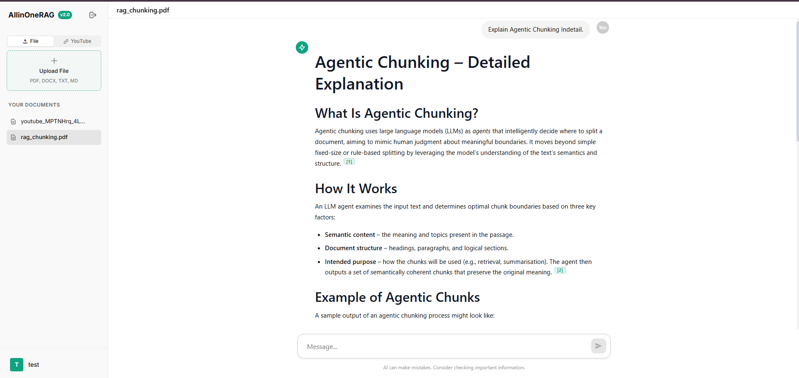
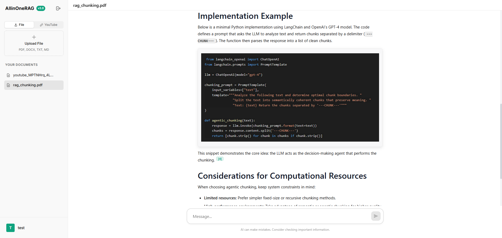
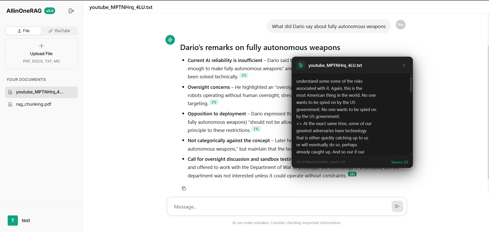
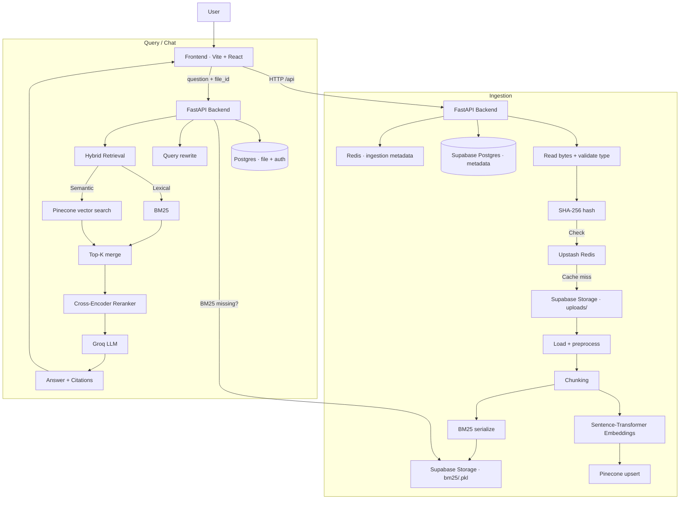

# AskMyDocs — Chat With Your Documents

> **Upload documents. Ask questions. Get grounded answers with citations.**
> A full-stack RAG system built for real-world document intelligence

[](https://fastapi.tiangolo.com/)
[](https://react.dev/)
[](https://www.pinecone.io/)
[](https://supabase.com/)
[](LICENSE)

---

## Screenshots

### Dashboard





### YouTube Ingestion



## What Makes This Different

Most RAG demos skip the hard parts. This project tackles them head-on:

- **Hybrid retrieval** (BM25 + vector embeddings) — not just cosine similarity
- **Cross-encoder reranking** — precision on top of recall
- **Query rewriting** — reformulates user questions into better search queries for retrieval
- **Ephemeral storage survival** — BM25 artifacts persisted to Supabase, rehydrated on cold start
- **Cross-domain auth** — session cookies with `SameSite=None; Secure` across Vercel ↔ Render
- **Duplicate-aware ingestion** — SHA-256 file hashing prevents redundant embedding work
- **Two-layer caching** — Redis for both document embeddings (30-day TTL) and query results (1-hour TTL)
- **Parallel + batch ingestion** — parallel dense/sparse computation and concurrent batch upserts to Pinecone
- **LangSmith observability** — traces for rewrite → retrieval → rerank → generation (debuggable RAG)

---

## Architecture

```
┌────────────────────────────────────────────────────────────────────┐
│                         INGESTION PIPELINE                         │
│                                                                    │
│  Upload → SHA-256 Hash → Redis Cache Check                         │
│                ↓ (cache miss)                                      │
│  Supabase Storage (raw file) → Chunk → Embed → Pinecone (vectors) │
│                                       ↓                           │
│                              BM25 Index → Supabase Storage (pkl)   │
└────────────────────────────────────────────────────────────────────┘

┌────────────────────────────────────────────────────────────────────┐
│                           QUERY PIPELINE                           │
│                                                                    │
│  Question → Query Rewrite → Redis Cache Check                      │
│                ↓ (cache miss)                                      │
│  Parallel: [BM25 Retrieval] + [Pinecone Vector Search]             │
│                ↓                                                   │
│  Top-K Merge → Rerank (Cross-Encoder) → Groq LLM                  │
│                ↓                                                   │
│  Answer + Cited Chunks → Frontend                                  │
└────────────────────────────────────────────────────────────────────┘
```

**Full system flow (Mermaid):**



---

## Tech Stack

| Layer | Technology | Why |
|---|---|---|
| **Frontend** | React 18, TypeScript, Vite | Fast DX, type-safe |
| **Backend** | FastAPI (async) | Non-blocking I/O, auto docs |
| **Database** | Postgres (asyncpg) via docker-compose locally, Supabase in production | Managed, scalable |
| **Storage** | Local disk by default; optional Supabase Storage mirror | Local-first; mirror survives ephemeral hosts |
| **Vector DB** | Pinecone | Managed ANN at scale |
| **Cache** | Upstash Redis | Serverless Redis, TTL support |
| **LLM** | Groq (fallback) · OpenRouter · OmniRoute — switchable via `LLM_PROVIDER` | Free-tier speed; self-hosted routing option |
| **Embeddings** | Sentence Transformers | Local, no API cost |
| **Reranker** | Cross-Encoder | Precision layer on top of recall |
| **Auth** | Session cookies (bcrypt + HTTP-only) | Secure, stateful |

---

## Key Engineering Decisions

### Why Hybrid Retrieval?

Vector search excels at semantic similarity but fails on exact keyword matches — product IDs, names, rare tokens. BM25 catches what embeddings miss. Running both in parallel and merging top-K results consistently outperforms either approach alone.

### Why Store BM25 as a Pickle in Cloud Storage? (optional)

Local development keeps everything on disk. On ephemeral hosts (Render free tier), a restart wipes local files — so when `SUPABASE_STORAGE_ENABLED=1`, the BM25 index is serialized and uploaded to Supabase Storage, letting the backend re-download it on cold start without re-indexing the document. Ingestion stays a one-time cost.

### Why SHA-256 Hash Before Embedding?

Computing embeddings for a 200-page PDF costs real time and money. Hashing the raw bytes before touching the embedding model means identical uploads return instantly from Redis — zero redundant work.

### Why Session Cookies Instead of JWTs?

JWTs are stateless and can't be revoked without extra infrastructure. For this app, session-based auth with HTTP-only cookies gives server-side revocation, protects against XSS token theft, and is straightforward to implement securely.

### Why Query Rewriting?

Sometimes the LLM is capable, but retrieval fails because the question is:

- too conversational ("tell me about this")
- too vague ("explain it")
- missing the keywords that appear in the document

So the backend rewrites the user question into a **retrieval-optimized search query** before running hybrid search.

- Enabled by default
- Can be disabled via:

```env
QUERY_REWRITE_ENABLED=true
```

### Chunking evolution (what I tried, what worked)

I iterated on chunking because it had a direct impact on retrieval quality and citations:

- **RecursiveCharacterTextSplitter (baseline)**
  - Easy to start with.
  - Downside: can merge unrelated parts of the document into one chunk.
- **Structured chunking (section-aware)**
  - Preserves headings/sections.
  - Result: cleaner citations and fewer off-topic chunks.
- **Structured token-aware recursive splitting**
  - Prevents chunks from getting too large for the model.
  - Result: better context packing, fewer partial answers, higher quality responses.

---

## Getting Started

### Prerequisites

- Python 3.9+, Node.js 18+, Docker
- Accounts: [Groq](https://console.groq.com), [Pinecone](https://app.pinecone.io), [Supabase](https://supabase.com), [Upstash](https://upstash.com)

### 1. Clone and configure

```bash
git clone https://github.com/hetbabariya/AskMyDocs
cd AskMyDocs
cp .env.example .env
```

Fill in `.env`:

```env
GROQ_API_KEY=your_groq_key
PINECONE_API_KEY=your_pinecone_key
HF_API_TOKEN=your_hf_token      # embeddings via HF Inference API
SECRET_KEY=your_secret_key   # python -c "import secrets; print(secrets.token_urlsafe(32))"

REDIS_URL=redis://localhost:6379/0

# LLM provider selection
#   auto (default) = OpenRouter if OPENROUTER_API_KEY is set, else Groq
#   groq | openrouter | omniroute = force a provider (Groq stays the runtime fallback)
LLM_PROVIDER=auto

# Optional — OpenRouter (https://openrouter.ai/keys)
# OPENROUTER_API_KEY=sk-or-your_key_here
# OPENROUTER_MODEL=arcee-ai/trinity-large-preview:free
# OPENROUTER_AGENT_MODEL=stepfun/step-3.5-flash:free

# Optional — OmniRoute, self-hosted OpenAI-compatible router (default :20128)
# OMNIROUTE_API_KEY=your_omniroute_key
# OMNIROUTE_BASE_URL=http://localhost:20128/v1
# OMNIROUTE_MODEL=cx/gpt-5.5
# OMNIROUTE_AGENT_MODEL=          # defaults to OMNIROUTE_MODEL

# Storage is LOCAL-FIRST — no cloud storage needed for development.
# Raw files → backend_storage/uploads, BM25 pickles → backend_storage/bm25.
#
# Optional production mirror (ephemeral hosts):
# SUPABASE_STORAGE_ENABLED=1
# SUPABASE_URL=https://<project>.supabase.co
# SUPABASE_SERVICE_ROLE_KEY=your_service_role_key
# SUPABASE_BUCKET=AllInOneRag

# Optional: query rewriting
QUERY_REWRITE_ENABLED=true
```

### 2. Start local services

```bash
docker-compose up -d
docker-compose ps   # verify postgres + redis are running
```

### 3. Backend setup

```bash
pip install -r backend/requirements.txt
python -m backend.api.database   # creates tables
uvicorn backend.api.main:app --reload --host 0.0.0.0 --port 8000
```

### 4. Frontend setup

```bash
cd frontend
npm install
npm run dev
```

App is at `http://localhost:5173`, API docs at `http://localhost:8000/docs`.

---

## API Reference

### Auth
| Method | Endpoint | Description |
|---|---|---|
| `POST` | `/register` | Create account |
| `POST` | `/login` | Login, set session cookie |
| `POST` | `/logout` | Destroy session |
| `GET` | `/me` | Current user info |

### Files
| Method | Endpoint | Description |
|---|---|---|
| `GET` | `/files` | List user's files |
| `POST` | `/ingest` | Upload + process document |
| `DELETE` | `/files/{filename}` | Delete file |

### Chat
| Method | Endpoint | Description |
|---|---|---|
| `POST` | `/chat` | Ask a question, get grounded answer |
| `GET` | `/chat/stream` | SSE streaming answer (token events + done event) |
| `GET` | `/chat/history` | Retrieve conversation history |

### System
| Method | Endpoint | Description |
|---|---|---|
| `GET` | `/health` | Health check |
| `GET` | `/cache/stats` | Redis hit rate + key count |

```bash
# Example cache stats response
curl http://localhost:8000/cache/stats
# → {"keyspace_hits": 150, "keyspace_misses": 50, "total_keys": 25, "hit_rate": 0.75}
```

---

## Caching Strategy

```
File Upload
───────────
1. Compute SHA-256 of raw bytes
2. Check Redis → hit? return instantly (30-day TTL)
3. Miss → embed, upsert Pinecone, cache metadata

Query
─────
1. Hash(question + file_id) as cache key
2. Check Redis → hit? return with ⚡ Cached badge (1-hour TTL)
3. Miss → full RAG pipeline → cache result

File cache
─────────
1. Hash(file bytes)
2. Check Redis → hit? skip ingestion and reuse prior metadata
3. Miss → ingest and cache metadata
```

---

## Security

- Passwords hashed with **bcrypt** (cost factor 12)
- Session tokens in **HTTP-only cookies** (not accessible via JS)
- **CORS** restricted to specific origins
- All DB queries use **parameterized statements** (no SQL injection surface)
- Input validated with **Pydantic schemas**

---

## Performance

- **Async/await** throughout — no blocking I/O
- **Connection pooling**: 20 Postgres connections + 10 overflow
- **Parallel retrieval**: BM25 and vector search run concurrently with `asyncio.gather`
- **Parallel embedding compute**: dense embeddings and BM25 sparse vectors computed concurrently during ingestion
- **Batch + concurrent upserts**: Pinecone upserts are sent in batches and dispatched concurrently to reduce round-trips
- **Model singletons**: Sentence Transformer and cross-encoder loaded once at startup
- **Two-layer caching**: eliminates redundant embedding + LLM calls

---

## Monitoring

```bash
# Cache performance
curl http://localhost:8000/cache/stats

# Service health
curl http://localhost:8000/health

# Logs
docker-compose logs -f
```

### LangSmith observability (optional)

This project supports LangSmith tracing for debugging the RAG pipeline (rewrite → retrieve → rerank → generate).

Set these environment variables:

```env
LANGCHAIN_TRACING_V2=true
LANGCHAIN_API_KEY=your_langsmith_api_key
LANGCHAIN_PROJECT=AskMyDocs
```

---

## Troubleshooting

**Database won't connect**
```bash
docker-compose ps        # is postgres running?
docker-compose logs postgres
docker-compose restart postgres
```

**Redis errors**
```bash
docker-compose exec redis redis-cli ping   # should return PONG
```

**Frontend build fails**
```bash
cd frontend && rm -rf node_modules package-lock.json && npm install
```

**BM25 artifact missing on query**
The backend auto-downloads from Supabase Storage on first query after restart. Check `SUPABASE_STORAGE_ENABLED=1` is set and the bucket exists.

**Streaming endpoint doesn’t work behind a proxy**
Make sure the reverse proxy supports SSE and disables buffering. (In Nginx, `proxy_buffering off`.)

---

## Challenges & Solutions

### Answer quality improvements

- **Structured + token-aware chunking**
  - Cleaner chunks, fewer irrelevant merges
  - Better grounding and more accurate citations
- **Query rewriting**
  - Makes retrieval more reliable for vague / conversational questions
- **Cross-encoder reranking**
  - Improves precision before generation

### Chunking iteration (what didn’t work well at first)

- Started with **RecursiveCharacterTextSplitter**
  - Quick baseline
  - But chunk boundaries sometimes mixed unrelated sections
- Moved to **structure-aware chunking**, then **structured token-aware recursive splitting**
  - Better section alignment
  - Better context packing → higher answer quality

### Retrieval reliability

- Before query rewrite, some questions were too conversational and retrieval occasionally missed the right chunks.
- Adding query rewriting improved recall for hybrid search.

### Speed optimizations

- Dense + sparse computation in parallel (embeddings + BM25)
- Batch + concurrent Pinecone upserts

### Debuggability

- Added **LangSmith tracing** to inspect rewrite → retrieval → rerank → generation and pinpoint where quality/latency issues come from.

---

## Project Structure

```
AskMyDocs/
├── backend/
│   ├── Dockerfile
│   ├── requirements.txt
│   ├── api/
│   │   ├── api.py
│   │   ├── auth.py
│   │   ├── cache.py
│   │   ├── database.py
│   │   ├── main.py
│   │   ├── models.py
│   │   ├── schemas.py
│   │   ├── supabase_storage.py
│   │   └── utils.py
│   └── rag/
│       ├── file_registry.py
│       ├── loader.py
│       ├── pinecone_hybrid.py
│       ├── service.py
│       └── settings.py
├── frontend/
│   ├── Dockerfile
│   ├── nginx.conf
│   ├── package.json
│   ├── vite.config.ts
│   └── src/
├── docker-compose.yml
├── .dockerignore
└── README.md
```

---

## License

MIT — use it, learn from it, build on it.

---

## Acknowledgments

[LangChain](https://github.com/langchain-ai/langchain) · [Pinecone](https://www.pinecone.io/) · [Groq](https://groq.com/) · [FastAPI](https://fastapi.tiangolo.com/) · [Supabase](https://supabase.com/) · [Upstash](https://upstash.com/)